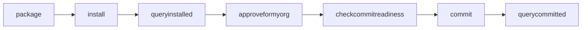

The `peer lifecycle chaincode` command implements the Fabric chaincode lifecycle. Use these commands to take a chaincode through its full lifecycle: package it, install it on peers, approve the definition for your organization, verify readiness, and commit the definition to a channel.

<Info>
  This is the current chaincode lifecycle introduced in Fabric v2.0. For legacy pre-v2.0 commands, see [`peer chaincode`](/commands/peer-chaincode).
</Info>

## Lifecycle workflow



Each organization that will endorse transactions must install the chaincode package and approve the definition. Once enough organizations have approved (satisfying the `Channel/Application/Endorsement` policy, a majority by default), any one of them can commit the definition to the channel.

## Global flags

All `peer lifecycle chaincode` subcommands share these global flags for orderer connectivity:

<ParamField path="--cafile" type="string">
  Path to a file containing PEM-encoded trusted certificate(s) for the ordering endpoint.
</ParamField>

<ParamField path="--certfile" type="string">
  Path to a file containing the PEM-encoded X509 public key for mutual TLS with the orderer.
</ParamField>

<ParamField path="--clientauth" type="boolean">
  Use mutual TLS when communicating with the orderer endpoint.
</ParamField>

<ParamField path="--connTimeout" type="duration" default="3s">
  Timeout for client to connect.
</ParamField>

<ParamField path="--keyfile" type="string">
  Path to a file containing the PEM-encoded private key for mutual TLS with the orderer.
</ParamField>

<ParamField path="-o, --orderer" type="string">
  Ordering service endpoint (`<hostname>:<port>`).
</ParamField>

<ParamField path="--ordererTLSHostnameOverride" type="string">
  Hostname override for TLS validation when connecting to the orderer.
</ParamField>

<ParamField path="--tls" type="boolean">
  Use TLS when communicating with the orderer endpoint.
</ParamField>

<ParamField path="--tlsHandshakeTimeShift" type="duration">
  Shift the time backwards for certificate expiration checks during TLS handshakes with the orderer. Useful when orderer certificates have expired.
</ParamField>

---

## peer lifecycle chaincode package

Packages a chaincode into a `.tar.gz` archive ready for installation.

**Syntax**

```bash
peer lifecycle chaincode package <outputfile> [flags]
```

**Flags**

<ParamField path="-p, --path" type="string" required>
  Path to the chaincode source. For Go chaincode, this is the import path or a path relative to your working directory.
</ParamField>

<ParamField path="--label" type="string" required>
  A human-readable label for the package. Used to identify the package after installation. Convention is `<name>_<version>`, e.g., `mycc_1.0`.
</ParamField>

<ParamField path="-l, --lang" type="string" default="golang">
  The language the chaincode is written in. Accepted values: `golang`, `node`, `java`.
</ParamField>

<ParamField path="--connectionProfile" type="string">
  Fully qualified path to a connection profile that provides peer connection information.
</ParamField>

<ParamField path="--peerAddresses" type="string[]">
  Addresses of the peers to connect to. Repeat the flag for multiple peers.
</ParamField>

<ParamField path="--tlsRootCertFiles" type="string[]">
  Paths to the TLS root cert files of the peers specified by `--peerAddresses`. The order and count must match.
</ParamField>

**Example**

Package a Go chaincode located at `$CHAINCODE_DIR` and label it `myccv1`:

```bash
peer lifecycle chaincode package mycc.tar.gz \
  --path $CHAINCODE_DIR \
  --lang golang \
  --label myccv1
```

---

## peer lifecycle chaincode install

Installs a packaged chaincode on a peer.

**Syntax**

```bash
peer lifecycle chaincode install <packageFile> [flags]
```

**Flags**

<ParamField path="--connectionProfile" type="string">
  Fully qualified path to a connection profile that provides peer connection information.
</ParamField>

<ParamField path="--peerAddresses" type="string[]">
  Addresses of the peers to install on. Repeat the flag for multiple peers.
</ParamField>

<ParamField path="--targetPeer" type="string">
  When using a connection profile, the name of the peer to target for this operation.
</ParamField>

<ParamField path="--tlsRootCertFiles" type="string[]">
  Paths to the TLS root cert files for the peers specified by `--peerAddresses`.
</ParamField>

**Example**

Install `mycc.tar.gz` on `peer0.org1.example.com:7051`:

```bash
peer lifecycle chaincode install mycc.tar.gz \
  --peerAddresses peer0.org1.example.com:7051
```

On success, the peer returns the **package ID** — a combination of the package label and a hash of the package contents. Record this value; you will need it for `approveformyorg`.

```text
2019-03-13 13:48:53.691 UTC [cli.lifecycle.chaincode] submitInstallProposal -> INFO 001 Installed remotely: response:<status:200 ...>
2019-03-13 13:48:53.691 UTC [cli.lifecycle.chaincode] submitInstallProposal -> INFO 002 Chaincode code package identifier: mycc:a7ca45a7cc85f1d89c905b775920361ed089a364e12a9b6d55ba75c965ddd6a9
```

---

## peer lifecycle chaincode queryinstalled

Queries the list of chaincode packages installed on a peer.

**Syntax**

```bash
peer lifecycle chaincode queryinstalled [flags]
```

**Flags**

<ParamField path="-O, --output" type="string">
  Output format for query results. Default is human-readable plain text. Use `json` for machine-readable output.
</ParamField>

<ParamField path="--connectionProfile" type="string">
  Fully qualified path to a connection profile.
</ParamField>

<ParamField path="--peerAddresses" type="string[]">
  Addresses of the peers to query.
</ParamField>

<ParamField path="--targetPeer" type="string">
  When using a connection profile, the name of the peer to target.
</ParamField>

<ParamField path="--tlsRootCertFiles" type="string[]">
  Paths to the TLS root cert files for the peers specified by `--peerAddresses`.
</ParamField>

**Examples**

<Tabs>
  <Tab title="Plain text">
    ```bash
    peer lifecycle chaincode queryinstalled \
      --peerAddresses peer0.org1.example.com:7051
    ```

    ```text
    Get installed chaincodes on peer:
    Package ID: myccv1:a7ca45a7cc85f1d89c905b775920361ed089a364e12a9b6d55ba75c965ddd6a9, Label: myccv1
    ```
  </Tab>
  <Tab title="JSON">
    ```bash
    peer lifecycle chaincode queryinstalled \
      --peerAddresses peer0.org1.example.com:7051 \
      --output json
    ```

    ```json
    {
      "installed_chaincodes": [
        {
          "package_id": "mycc_1:aab9981fa5649cfe25369fce7bb5086a69672a631e4f95c4af1b5198fe9f845b",
          "label": "mycc_1",
          "references": {
            "mychannel": {
              "chaincodes": [
                {
                  "name": "mycc",
                  "version": "1"
                }
              ]
            }
          }
        }
      ]
    }
    ```
  </Tab>
</Tabs>

---

## peer lifecycle chaincode getinstalledpackage

Retrieves an installed chaincode package from a peer and writes it to disk.

**Syntax**

```bash
peer lifecycle chaincode getinstalledpackage [outputfile] [flags]
```

**Flags**

<ParamField path="--package-id" type="string" required>
  The package identifier returned by `queryinstalled`. Format: `<label>:<hash>`.
</ParamField>

<ParamField path="--output-directory" type="string">
  Directory to write the downloaded package to. Defaults to the current working directory.
</ParamField>

<ParamField path="--connectionProfile" type="string">
  Fully qualified path to a connection profile.
</ParamField>

<ParamField path="--peerAddresses" type="string[]">
  Addresses of the peers to connect to.
</ParamField>

<ParamField path="--targetPeer" type="string">
  When using a connection profile, the name of the peer to target.
</ParamField>

<ParamField path="--tlsRootCertFiles" type="string[]">
  Paths to the TLS root cert files for the peers specified by `--peerAddresses`.
</ParamField>

**Example**

Download a package and write it to `/tmp`:

```bash
peer lifecycle chaincode getinstalledpackage \
  --package-id myccv1:a7ca45a7cc85f1d89c905b775920361ed089a364e12a9b6d55ba75c965ddd6a9 \
  --output-directory /tmp \
  --peerAddresses peer0.org1.example.com:7051
```

---

## peer lifecycle chaincode approveformyorg

Approves a chaincode definition for your organization. This must be done by a sufficient number of organizations before the definition can be committed.

**Syntax**

```bash
peer lifecycle chaincode approveformyorg [flags]
```

**Required flags**

<ParamField path="-C, --channelID" type="string" required>
  The channel on which to approve the chaincode definition.
</ParamField>

<ParamField path="-n, --name" type="string" required>
  Name of the chaincode.
</ParamField>

<ParamField path="-v, --version" type="string" required>
  Version of the chaincode (e.g., `1.0`).
</ParamField>

<ParamField path="--sequence" type="integer" required>
  The sequence number of this chaincode definition for the channel. Start at `1` and increment by one for each upgrade.
</ParamField>

**Optional flags**

<ParamField path="--package-id" type="string">
  The package identifier returned by `queryinstalled`. Omit if approving a definition without a locally installed package (e.g., for organizations that will only endorse but not run chaincode).
</ParamField>

<ParamField path="--signature-policy" type="string">
  Endorsement policy expressed as a signature policy string, e.g., `"AND ('Org1MSP.peer','Org2MSP.peer')"`. Mutually exclusive with `--channel-config-policy`.
</ParamField>

<ParamField path="--channel-config-policy" type="string">
  Endorsement policy expressed as a reference to a policy in the channel configuration, e.g., `Channel/Application/Endorsement`. Mutually exclusive with `--signature-policy`. Default is `Channel/Application/Endorsement`.
</ParamField>

<ParamField path="--collections-config" type="string">
  Fully qualified path to the private data collection configuration JSON file.
</ParamField>

<ParamField path="-E, --endorsement-plugin" type="string">
  The name of the endorsement plugin to use. Defaults to `escc`.
</ParamField>

<ParamField path="-V, --validation-plugin" type="string">
  The name of the validation plugin to use. Defaults to `vscc`.
</ParamField>

<ParamField path="--init-required" type="boolean">
  Whether the chaincode requires invoking its `Init` function before other functions can be called. Used with legacy chaincodes that have an `Init` function.
</ParamField>

<ParamField path="--peerAddresses" type="string[]">
  Addresses of the peers to connect to for endorsement.
</ParamField>

<ParamField path="--tlsRootCertFiles" type="string[]">
  Paths to the TLS root cert files for the peers specified by `--peerAddresses`.
</ParamField>

<ParamField path="--connectionProfile" type="string">
  Fully qualified path to a connection profile.
</ParamField>

<ParamField path="--waitForEvent" type="boolean" default="true">
  Wait for the commit event from each peer's deliver service confirming the transaction has been committed.
</ParamField>

<ParamField path="--waitForEventTimeout" type="duration" default="30s">
  How long to wait for the commit event.
</ParamField>

**Examples**

Approve using a signature policy:

```bash
export ORDERER_CA=/opt/gopath/src/github.com/hyperledger/fabric/peer/crypto/ordererOrganizations/example.com/orderers/orderer.example.com/msp/tlscacerts/tlsca.example.com-cert.pem

peer lifecycle chaincode approveformyorg \
  -o orderer.example.com:7050 \
  --tls --cafile $ORDERER_CA \
  --channelID mychannel \
  --name mycc \
  --version 1.0 \
  --sequence 1 \
  --package-id myccv1:a7ca45a7cc85f1d89c905b775920361ed089a364e12a9b6d55ba75c965ddd6a9 \
  --signature-policy "AND ('Org1MSP.peer','Org2MSP.peer')"
```

Approve using a channel config policy reference:

```bash
peer lifecycle chaincode approveformyorg \
  -o orderer.example.com:7050 \
  --tls --cafile $ORDERER_CA \
  --channelID mychannel \
  --name mycc \
  --version 1.0 \
  --sequence 1 \
  --package-id myccv1:a7ca45a7cc85f1d89c905b775920361ed089a364e12a9b6d55ba75c965ddd6a9 \
  --channel-config-policy Channel/Application/Admins
```

<Warning>
  The `--channelID`, `--name`, `--version`, and `--sequence` flags are required. Omitting any of them causes the command to return an error.
</Warning>

---

## peer lifecycle chaincode checkcommitreadiness

Checks whether a chaincode definition has received sufficient approvals to be committed to a channel. Returns the approval status for each organization.

**Syntax**

```bash
peer lifecycle chaincode checkcommitreadiness [flags]
```

**Flags**

<ParamField path="-C, --channelID" type="string" required>
  The channel on which to check commit readiness.
</ParamField>

<ParamField path="-n, --name" type="string" required>
  Name of the chaincode.
</ParamField>

<ParamField path="-v, --version" type="string" required>
  Version of the chaincode.
</ParamField>

<ParamField path="--sequence" type="integer" required>
  The sequence number of the chaincode definition to check.
</ParamField>

<ParamField path="--signature-policy" type="string">
  Endorsement policy as a signature policy string.
</ParamField>

<ParamField path="--channel-config-policy" type="string">
  Endorsement policy as a channel config policy reference.
</ParamField>

<ParamField path="--collections-config" type="string">
  Path to the private data collection configuration JSON file.
</ParamField>

<ParamField path="-E, --endorsement-plugin" type="string">
  The endorsement plugin name.
</ParamField>

<ParamField path="-V, --validation-plugin" type="string">
  The validation plugin name.
</ParamField>

<ParamField path="--init-required" type="boolean">
  Whether the chaincode requires invoking `Init`.
</ParamField>

<ParamField path="-O, --output" type="string">
  Output format: plain text (default) or `json`.
</ParamField>

<ParamField path="--inspect" type="boolean">
  Output additional mismatch details when an organization's approval is `false`. Identifies which fields differ from the proposed definition.
</ParamField>

<ParamField path="--peerAddresses" type="string[]">
  Addresses of the peers to query.
</ParamField>

<ParamField path="--tlsRootCertFiles" type="string[]">
  Paths to the TLS root cert files for the peers specified by `--peerAddresses`.
</ParamField>

<ParamField path="--connectionProfile" type="string">
  Fully qualified path to a connection profile.
</ParamField>

**Examples**

<Tabs>
  <Tab title="Plain text">
    ```bash
    peer lifecycle chaincode checkcommitreadiness \
      --channelID mychannel \
      --name mycc \
      --version 1.0 \
      --sequence 1 \
      --init-required
    ```

    ```text
    Chaincode definition for chaincode 'mycc', version '1.0', sequence '1' on channel
    'mychannel' approval status by org:
    Org1MSP: true
    Org2MSP: true
    ```
  </Tab>
  <Tab title="JSON">
    ```bash
    peer lifecycle chaincode checkcommitreadiness \
      --channelID mychannel \
      --name mycc \
      --version 1.0 \
      --sequence 1 \
      --output json
    ```

    ```json
    {
      "Approvals": {
        "Org1MSP": true,
        "Org2MSP": true
      }
    }
    ```
  </Tab>
  <Tab title="With --inspect">
    ```bash
    peer lifecycle chaincode checkcommitreadiness \
      --channelID mychannel \
      --name basic \
      --version 1.0 \
      --sequence 1 \
      --inspect
    ```

    ```text
    Chaincode definition for chaincode 'basic', version '1.0', sequence '1' on channel 'mychannel' approval status by org:
    Org1MSP: true
    Org2MSP: false (mismatch: [EndorsementInfo, ValidationInfo, Collections])
    Org3MSP: false (mismatch: [ChaincodeParameters])
    ```

    The `--inspect` flag identifies mismatches in the following field groups:
    - `ChaincodeParameters` — sequence number or chaincode name mismatch
    - `EndorsementInfo` — version, `InitRequired`, or endorsement plugin mismatch
    - `ValidationInfo` — validation parameter or validation plugin mismatch
    - `Collections` — private data collection configuration mismatch
  </Tab>
</Tabs>

---

## peer lifecycle chaincode commit

Commits the chaincode definition to a channel. Must be called after sufficient organizations have approved the definition. Collects endorsements from peers of multiple organizations.

**Syntax**

```bash
peer lifecycle chaincode commit [flags]
```

**Required flags**

<ParamField path="-C, --channelID" type="string" required>
  The channel on which to commit the chaincode definition.
</ParamField>

<ParamField path="-n, --name" type="string" required>
  Name of the chaincode.
</ParamField>

<ParamField path="-v, --version" type="string" required>
  Version of the chaincode.
</ParamField>

<ParamField path="--sequence" type="integer" required>
  The sequence number of the chaincode definition being committed.
</ParamField>

**Optional flags**

<ParamField path="--signature-policy" type="string">
  Endorsement policy as a signature policy string.
</ParamField>

<ParamField path="--channel-config-policy" type="string">
  Endorsement policy as a channel config policy reference.
</ParamField>

<ParamField path="--collections-config" type="string">
  Path to the private data collection configuration JSON file.
</ParamField>

<ParamField path="-E, --endorsement-plugin" type="string">
  The endorsement plugin name.
</ParamField>

<ParamField path="-V, --validation-plugin" type="string">
  The validation plugin name.
</ParamField>

<ParamField path="--init-required" type="boolean">
  Whether the chaincode requires invoking `Init` before other functions.
</ParamField>

<ParamField path="--peerAddresses" type="string[]">
  Addresses of the peers to collect endorsements from. Include peers from each endorsing organization.
</ParamField>

<ParamField path="--tlsRootCertFiles" type="string[]">
  Paths to TLS root cert files for each peer in `--peerAddresses`.
</ParamField>

<ParamField path="--connectionProfile" type="string">
  Fully qualified path to a connection profile.
</ParamField>

<ParamField path="--waitForEvent" type="boolean" default="true">
  Wait for the commit event from each peer's deliver service.
</ParamField>

<ParamField path="--waitForEventTimeout" type="duration" default="30s">
  How long to wait for the commit event.
</ParamField>

**Example**

Commit the chaincode definition, collecting endorsements from peers in both Org1 and Org2:

```bash
export ORDERER_CA=/opt/gopath/src/github.com/hyperledger/fabric/peer/crypto/ordererOrganizations/example.com/orderers/orderer.example.com/msp/tlscacerts/tlsca.example.com-cert.pem

peer lifecycle chaincode commit \
  -o orderer.example.com:7050 \
  --tls --cafile $ORDERER_CA \
  --channelID mychannel \
  --name mycc \
  --version 1.0 \
  --sequence 1 \
  --init-required \
  --peerAddresses peer0.org1.example.com:7051 \
  --peerAddresses peer0.org2.example.com:9051
```

```text
2019-03-18 16:14:27.258 UTC [chaincodeCmd] ClientWait -> INFO 001 txid [...] committed with status (VALID) at peer0.org2.example.com:9051
2019-03-18 16:14:27.321 UTC [chaincodeCmd] ClientWait -> INFO 002 txid [...] committed with status (VALID) at peer0.org1.example.com:7051
```

<Note>
  Only one organization needs to call `commit`. However, the `--peerAddresses` flag must include a peer from each organization whose endorsement is required by the channel's endorsement policy.
</Note>

---

## peer lifecycle chaincode querycommitted

Queries the chaincode definitions that have been committed to a channel.

**Syntax**

```bash
peer lifecycle chaincode querycommitted [flags]
```

**Flags**

<ParamField path="-C, --channelID" type="string" required>
  The channel to query.
</ParamField>

<ParamField path="-n, --name" type="string">
  Name of a specific chaincode to query. If omitted, all committed definitions on the channel are returned.
</ParamField>

<ParamField path="-O, --output" type="string">
  Output format: plain text (default) or `json`.
</ParamField>

<ParamField path="--peerAddresses" type="string[]">
  Addresses of the peers to query.
</ParamField>

<ParamField path="--tlsRootCertFiles" type="string[]">
  Paths to TLS root cert files for the peers specified by `--peerAddresses`.
</ParamField>

<ParamField path="--connectionProfile" type="string">
  Fully qualified path to a connection profile.
</ParamField>

**Examples**

<Tabs>
  <Tab title="Specific chaincode">
    ```bash
    peer lifecycle chaincode querycommitted \
      --channelID mychannel \
      --name mycc \
      --peerAddresses peer0.org1.example.com:7051
    ```

    ```text
    Committed chaincode definition for chaincode 'mycc' on channel 'mychannel':
    Version: 1, Sequence: 1, Endorsement Plugin: escc, Validation Plugin: vscc
    Approvals: [Org1MSP: true, Org2MSP: true]
    ```
  </Tab>
  <Tab title="All chaincodes">
    ```bash
    peer lifecycle chaincode querycommitted \
      --channelID mychannel \
      --peerAddresses peer0.org1.example.com:7051
    ```

    ```text
    Committed chaincode definitions on channel 'mychannel':
    Name: mycc, Version: 1, Sequence: 1, Endorsement Plugin: escc, Validation Plugin: vscc
    Name: yourcc, Version: 2, Sequence: 3, Endorsement Plugin: escc, Validation Plugin: vscc
    ```
  </Tab>
  <Tab title="JSON">
    ```bash
    peer lifecycle chaincode querycommitted \
      --channelID mychannel \
      --name mycc \
      --peerAddresses peer0.org1.example.com:7051 \
      --output json
    ```

    ```json
    {
      "sequence": 1,
      "version": "1",
      "endorsement_plugin": "escc",
      "validation_plugin": "vscc",
      "validation_parameter": "EiAvQ2hhbm5lbC9BcHBsaWNhdGlvbi9FbmRvcnNlbWVudA==",
      "collections": {},
      "init_required": true,
      "approvals": {
        "Org1MSP": true,
        "Org2MSP": true
      }
    }
    ```

    <Note>
      The `validation_parameter` field is base64-encoded. Decode it to read the policy string: `echo EiAvQ2hhbm5lbC9BcHBsaWNhdGlvbi9FbmRvcnNlbWVudA== | base64 -d`
    </Note>
  </Tab>
</Tabs>
