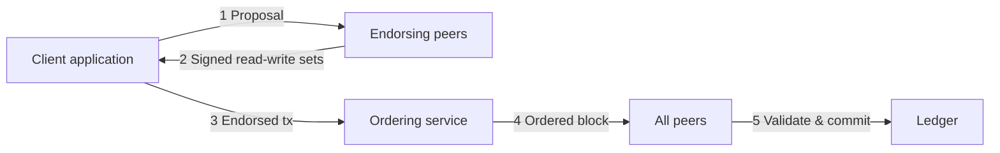

The Fabric model describes the core design decisions that give Hyperledger Fabric its distinctive character as an enterprise blockchain platform. Each element — assets, chaincode, the ledger, privacy mechanisms, membership services, and consensus — is designed to work together while remaining individually configurable.

<CardGroup cols={2}>
  <Card title="Key concepts" icon="book-open" href="/key-concepts">
    Peer roles, ordering, channels, MSP, and the transaction flow
  </Card>
  <Card title="Network operations" icon="network-wired" href="/operations/channels">
    Channels, private data, identity, and the gateway service
  </Card>
</CardGroup>

## Assets

In Fabric, an **asset** is anything of value that participants want to track and exchange on the network. Assets can represent tangible objects (real estate, manufactured goods, raw materials) or intangible ones (contracts, intellectual property, financial instruments).

Assets are represented as **key-value pairs**. Each key uniquely identifies an asset instance, and the value holds the asset's attributes. Values can be stored as:

| Format | Use case |
|--------|----------|
| **Binary** | Arbitrary byte payloads, protocol buffers, serialized structs |
| **JSON** | Human-readable structured data, rich query support with CouchDB |

State changes to assets — creation, update, and deletion — are recorded as transactions on the channel ledger. The full history of every state change is preserved in the immutable transaction log, while the current state is always available for direct lookup in the world state database.

<Tip>
Design your asset key structure carefully. Composite keys (e.g., `type~owner~id`) enable efficient range queries across related assets and are a common pattern in production chaincode.
</Tip>

## Chaincode

Chaincode is the **business logic layer** of Fabric. It defines the structure of assets and the rules governing all transactions that modify them.

When a transaction is proposed:

1. The client invokes a chaincode function with input parameters
2. The chaincode reads current state from the world state database
3. It produces a **read set** (keys and versions read) and a **write set** (keys and values to write)
4. The write set is applied to the ledger only after ordering and validation

Chaincode enforces the invariants of your data model — it is the only sanctioned way to change asset state.

### Chaincode vs smart contracts

<AccordionGroup>
  <Accordion title="Smart contract">
    A smart contract defines the transaction logic for a specific business domain. For example, a `vehicle` chaincode might contain separate `cars`, `boats`, and `trucks` smart contracts, each governing the lifecycle of its asset type. A smart contract maps directly to business concepts and operations.
  </Accordion>
  <Accordion title="Chaincode">
    A chaincode is the **deployment unit** — it packages one or more smart contracts and is installed on peers, then committed to a channel. Think of chaincode as the technical container that groups related smart contracts for lifecycle management. When a chaincode is deployed, all smart contracts within it become available to applications.
  </Accordion>
</AccordionGroup>

Chaincode can be written in **Go**, **Java**, or **Node.js**. Because Fabric's execute-order-validate architecture eliminates non-determinism before ordering, standard general-purpose languages are fully supported — no constrained DSLs are required.

### Chaincode isolation

Chaincode runs in an isolated container environment (Docker by default). It cannot directly access the underlying ledger files or the network stack. All state access goes through the Fabric chaincode shim API, which:

- Scopes reads and writes to the channel ledger for the executing peer
- Records the read set and write set for validation
- Enforces that chaincode cannot perform arbitrary I/O or non-deterministic operations that would break consensus

### System chaincode

In addition to user-deployed chaincode, Fabric uses **system chaincodes** that are built into the peer binary itself. These govern network-level operations:

| System chaincode | Purpose |
|-----------------|---------|
| `_lifecycle` | Manages the chaincode lifecycle (install, approve, commit) |
| `cscc` | Channel configuration system chaincode |
| `qscc` | Query system chaincode (ledger and block queries) |
| `vscc` | Validation system chaincode (endorsement policy enforcement) |

## Ledger features

The Fabric ledger is the sequenced, tamper-resistant record of all state transitions on a channel. It consists of two components that together provide both current-state access and full historical auditability.

### The blockchain (transaction log)

The blockchain component is an append-only sequence of blocks. Each block:

- Contains one or more endorsed and ordered transactions
- Stores a cryptographic hash of the previous block, forming an unbreakable chain
- Is immutable once written — no block can be deleted or altered without invalidating all subsequent blocks

Transactions within a block record the **versions** of keys read and written during chaincode execution, along with the endorsing peers' signatures.

### The world state

The world state is a key-value database that holds the **current values** of all assets. It is derived from replaying the transaction log, but is stored separately for efficient direct access.

Fabric supports two world state database backends:

<Tabs>
  <Tab title="LevelDB (default)">
    LevelDB is an embedded key-value store included with every peer. It supports:

    - Exact key lookups
    - Key range queries (lexicographic ordering)
    - Composite key queries

    LevelDB is the right choice for most deployments. It requires no external infrastructure and has excellent performance for key-based access patterns.
  </Tab>
  <Tab title="CouchDB">
    CouchDB is an external document database that stores JSON values. In addition to all LevelDB query capabilities, it supports:

    - **Rich JSON queries** using the Mango query language — filter by any field, combine conditions, use indexes
    - Full document history queries
    - Index-backed queries for production performance

    CouchDB is the right choice when your chaincode stores JSON assets and you need to query by attribute values rather than just by key.

    <Warning>
    CouchDB must be deployed as a separate process alongside each peer. Ensure you size, monitor, and back up CouchDB as part of your infrastructure operations.
    </Warning>
  </Tab>
</Tabs>

### Query capabilities summary

| Query type | LevelDB | CouchDB |
|------------|---------|---------|
| Key lookup | Yes | Yes |
| Key range query | Yes | Yes |
| Composite key query | Yes | Yes |
| Rich JSON / attribute query | No | Yes |
| History query (by key) | Yes | Yes |

### Ledger per channel

There is exactly one ledger per channel. Every peer that joins a channel maintains a full replica of that channel's ledger. This per-channel isolation means:

- Ledger data from one channel is never visible on another channel
- Each channel can have different chaincode, policies, and member organizations
- A peer belonging to multiple channels maintains independent ledger replicas, one per channel

<Note>
The blockchain component of the ledger (the transaction log) is not pluggable — it is always the hash-linked block structure described above. Only the world state database is configurable (LevelDB vs CouchDB).
</Note>

## Privacy

Enterprise use cases frequently require that transaction data remain confidential — visible only to the parties directly involved, not to every participant on the network. Fabric provides two complementary privacy mechanisms.

### Channels

A channel is a private communication and data subnet. The ledger for a channel is only replicated to peers that are members of that channel. Organizations that are not members of a channel cannot see any of its transactions, chaincode logic, or ledger data — even if they are participants in the broader Fabric network.

```
Fabric Network
├── Channel A  (Org1, Org2)
│   └── Ledger A — visible ONLY to Org1 and Org2 peers
└── Channel B  (Org1, Org3)
    └── Ledger B — visible ONLY to Org1 and Org3 peers
```

Channels are the strongest form of privacy — complete transaction isolation at the cost of infrastructure overhead (a separate ledger, chaincode deployment, and ordering per channel).

### Private data collections

Private data collections provide finer-grained privacy within a single channel. When a subset of channel members needs to keep certain transaction data confidential from the rest:

- The **actual data** is stored in a private, encrypted database on the authorized peers only — it never passes through the ordering service
- A **hash of the private data** is included in the regular channel transaction and committed to the shared ledger, providing proof of the transaction without revealing its contents
- Unauthorized peers on the channel receive the hash but cannot access the underlying values

<Tabs>
  <Tab title="Channels vs private data collections">

| Dimension | Channels | Private data collections |
|-----------|----------|--------------------------|
| Data visibility | Per-channel membership | Per-collection policy within a channel |
| Ledger isolation | Complete — separate ledger | Partial — hash on shared ledger |
| Chaincode | Separate deployment per channel | Single chaincode, collection-aware |
| Overhead | Higher (separate infrastructure) | Lower (shared channel infrastructure) |
| Best for | Full transaction isolation between org sets | Selective field-level privacy within a group |

  </Tab>
  <Tab title="Encryption at the application layer">
    As an additional layer, chaincode can encrypt individual field values using standard cryptographic algorithms (AES, RSA, etc.) before writing them to the ledger. Encrypted values are stored on-chain but are only decipherable by parties that possess the corresponding key.

    This approach can be combined with channels and private data collections for defense-in-depth privacy.
  </Tab>
</Tabs>

## Security and membership services

Fabric is a **permissioned** network — every participant must be authenticated before they can interact with the network. This authentication is based on Public Key Infrastructure (PKI).

### Public Key Infrastructure

Every entity in a Fabric network — peers, orderers, client applications, and administrators — has an identity backed by an **X.509 certificate** issued by a Certificate Authority (CA).

```
Certificate Authority (CA)
│
├── Root CA  (org root of trust)
│   └── Intermediate CA  (optional, operational separation)
│       ├── Peer certificate      → used by peer nodes
│       ├── Orderer certificate   → used by orderer nodes
│       ├── Admin certificate     → used by admin tools
│       └── Client certificate    → used by applications
```

X.509 certificates bind a public key to an identity. When a peer receives a transaction, it verifies the sender's signature against the certificate to confirm authenticity and check that the certificate was issued by a trusted CA.

### Membership Service Provider (MSP)

The MSP is the component that operationalizes PKI in Fabric. Each organization defines an MSP that specifies:

- The root CA(s) and intermediate CAs trusted by that organization
- The certificates of specific admin identities
- Certificate Revocation Lists (CRLs) for revoked certificates
- The organizational unit (OU) classifications (peer, client, admin, orderer)

MSP definitions are distributed to all peers and orderers via the channel configuration. This allows any node to verify the identity and role of any other participant.

<Note>
Fabric ships with its own **Fabric CA** server that implements the full enrollment and certificate management lifecycle. However, any standard X.509-compatible CA (including enterprise PKI systems like EJBCA or HashiCorp Vault PKI) can be used in its place.
</Note>

### Access control

Fabric implements access control at multiple layers:

| Layer | Mechanism |
|-------|-----------|
| **Channel** | Policies (Readers, Writers, Admins) defined in channel configuration |
| **Chaincode** | Endorsement policies specifying required organizational signatures |
| **Peer** | MSP-based verification of every inbound message |
| **Ordering service** | Channel policies enforced by orderers on configuration and transaction submissions |

## Consensus

In Fabric, consensus is not a single algorithm — it is an **end-to-end property** of the entire transaction lifecycle. A transaction achieves consensus only after it has passed through all three phases of the execute-order-validate flow.

### The full-circle view of consensus

<Steps>
  <Step title="Endorsement (execute phase)">
    Endorsing peers simulate the transaction, verify the client's identity and channel membership, and produce a signed read-write set. The endorsement policy specifies which organizations must sign before the transaction can proceed.

    This phase provides: **policy enforcement, identity verification, execution correctness**.
  </Step>
  <Step title="Ordering">
    The ordering service establishes a canonical, deterministic sequence of endorsed transactions and packages them into blocks. Raft (CFT) or SmartBFT (BFT) consensus runs here, ensuring all peers receive identical blocks.

    This phase provides: **total order, finality, block formation**.
  </Step>
  <Step title="Validation and commitment">
    Every peer independently validates each transaction in the delivered block:
    - Endorsement policy check (correct signatures from required orgs)
    - Read-set version check (no conflicting writes since execution — double-spend protection)
    - Commitment of valid transactions to the world state

    This phase provides: **ledger consistency, conflict detection, double-spend prevention**.
  </Step>
</Steps>

Because consensus is woven through every phase — not limited to the ordering step — Fabric provides strong guarantees:

- **Finality** — once a block is committed, it cannot be reverted (no forks)
- **Consistency** — all peers on a channel always converge to the same ledger state
- **Integrity** — invalid or malicious transactions are filtered out, not silently committed

### Pluggable ordering

The ordering service is a modular component. Two implementations are currently available:

<AccordionGroup>
  <Accordion title="Raft (recommended)" defaultOpen={true}>
    Raft is a crash fault-tolerant (CFT) consensus protocol. It can tolerate up to `(n-1)/2` failed orderer nodes in a cluster of `n` nodes (e.g., a 5-node cluster tolerates 2 failures).

    Raft uses a leader-follower model. One orderer node acts as leader and drives block creation; followers replicate the log. If the leader fails, a new leader is elected automatically.

    Raft is the default recommendation for production Fabric networks. It is embedded in the orderer binary and requires no external coordination service.
  </Accordion>
  <Accordion title="SmartBFT">
    SmartBFT provides byzantine fault-tolerant (BFT) consensus. It can tolerate up to `(n-1)/3` faulty or malicious orderer nodes.

    BFT consensus is appropriate when the network spans organizations that do not fully trust each other and where the stronger guarantee of tolerating actively malicious orderer nodes is required.

    SmartBFT was introduced in Fabric v3.0.
  </Accordion>
</AccordionGroup>

<Info>
A Fabric network can run multiple ordering services simultaneously, each serving different channels with different consensus requirements.
</Info>

## The execute-order-validate architecture

Most blockchain platforms use an **order-execute** model: transactions are ordered first, then executed sequentially on every node. This forces smart contracts to be deterministic (requiring DSLs like Solidity) and creates sequential throughput bottlenecks.

Fabric inverts this with **execute-order-validate**:



### Why this matters

| Problem with order-execute | How execute-order-validate solves it |
|---------------------------|--------------------------------------|
| All nodes execute every transaction | Only endorsing peers execute — parallel, selective |
| Contracts must be deterministic (DSL required) | Non-determinism caught before ordering — standard languages work |
| Sequential throughput bottleneck | Execution and ordering are decoupled and scale independently |
| All nodes see all transaction data | Only endorsing peers simulate — confidentiality preserved |

The execute-order-validate architecture is the reason Fabric can simultaneously offer high throughput, standard programming languages, pluggable consensus, and strong privacy guarantees — capabilities that are in tension or unavailable in order-execute platforms.

## Summary

<AccordionGroup>
  <Accordion title="Quick reference: Fabric model components">

| Component | What it is | Key property |
|-----------|-----------|--------------|
| **Asset** | Key-value pair representing a business object | Binary or JSON; mutable state, immutable history |
| **Chaincode** | Business logic deployed to a channel | Written in Go, Java, or Node.js; runs in containers |
| **World state** | Current key-value snapshot of all assets | LevelDB or CouchDB; queryable directly |
| **Transaction log** | Immutable, hash-linked sequence of blocks | Full audit history; cannot be altered |
| **Channel** | Private communication and ledger subnet | Complete isolation; one ledger per channel |
| **Private data collection** | Selective field privacy within a channel | Hash on chain; data only on authorized peers |
| **MSP** | Maps X.509 certs to organizational identities | One per org; distributed via channel config |
| **Endorsement policy** | Specifies which orgs must sign a transaction | Evaluated at validation phase |
| **Ordering service** | Orders transactions and delivers blocks | Raft (CFT) or SmartBFT (BFT) |
| **Consensus** | Full-circle verification across all three phases | Finality, consistency, conflict detection |

  </Accordion>
</AccordionGroup>

## Further reading

<CardGroup cols={2}>
  <Card title="Key concepts" icon="book-open" href="/key-concepts">
    Peer roles, the transaction flow, MSP identity, and endorsement policies
  </Card>
  <Card title="Channels" icon="sitemap" href="/operations/channels">
    Creating and managing channels in a running network
  </Card>
  <Card title="Private data" icon="lock" href="/operations/private-data">
    Configuring private data collections for field-level privacy
  </Card>
  <Card title="Consensus" icon="arrows-rotate" href="/operations/consensus">
    Raft and SmartBFT ordering service configuration
  </Card>
</CardGroup>
